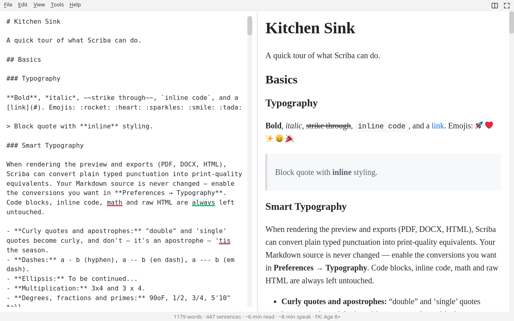

# Scriba Markdown Editor

<div>
    

**A configurable, no-nonsense, split-screen, off-line Markdown editor for coders** and other autistics with a *pretentious* Latin name. Designed with a restricted feature-set; useful, no bloat. Originally envisioned to be a simple application: text-editor on the left and a HTML preview on the right with no other features, but, my bad.

<p align="center">
:cucumber:

:cucumber:
<br />
  
  
  
  
</p>
</div>



## Features

### The Basics

- WOW! It's 2004 again with full CommonMark + GFM support (tables, strikethrough, task lists), image rendering from local files and URLs, and admonitions (note, tip, important, warning, caution) with custom titles and icons
- Editor and preview pane with configurable split-screen layout: have the preview on the right, the left, or hidden
- CSS-based theming: editor, preview, and chrome all styled from one file. Also included: sample themes for you to moan about. (Fair warning: Qt can't style application or dialogs titlebars)
- PDF export with print-specific CSS stylesheets
- Content searching including regex search
- An 80ms debounce timer that causes a little delay in the rendered preview to bother fast typers

### Standing on the shoulders of giants:

- Themable syntax highlighting for fenced code blocks (auto-detects language via highlight.js)
- [LaTeX math rendering](https://katex.org/) (KaTeX, inline `$...$` and display `$$...$$`)
- [Mermaid diagram rendering](https://mermaid.js.org/intro/) (flowcharts, sequence, state, pie)
- [Vega-Lite data visualization](https://vega.github.io/vega-lite/) (bar, scatter, line, layered, interactive)
- [md4c](https://github.com/mity/md4c) — CommonMark-compliant Markdown parser, modified to accept image sizes (`#WIDTHxHEIGHT` suffix)

### Candy:

- Full-screen mode (F11 or menu bar icon)
- Cursor restore on application start to pick up where you left off
- Sentence, word count, estimated reading time, and age-level to suitably patronise
- Table generator - Create either a table with a header row in markdown format, or an HTML generated table when no header row is needed. 
- Table auto-completion:: `Enter` auto creates a new row either in-cell or at end of the row, `Enter` on blank row ends autocomplete, `Tab` to next cell, `Shift+Tab` to previous cell
- Ordered and Unordered list item autocompletion after a previous list item.`Tab` to indent, `Shift+Tab` to outdent list items. `Enter` again to stop autocomplete
- Optional alternating table row striping
- Emojis + search because all technical documentation now requires them
- File / directory autocomplete when typing locations for local images / files in links e.g. ``
- A [sample.md](sample.md) file in resources with live examples of the features including admonitions, math, diagrams, charts, and images

## Shortcuts for Everything

| Shortcut | Action |
|---|---|
| Ctrl+N | New |
| Ctrl+O | Open |
| Ctrl+S | Save |
| Ctrl+Shift+S | Save As |
| Ctrl+R | Reload |
| Ctrl+P | Export PDF |
| Ctrl+F | Find |
| Ctrl+G | Vega-Lite Chart Builder |
| Ctrl+B | Toggle Preview Pane |
| Ctrl+E | Emoji Search :eyes: :mag: |
| Ctrl+T | Table Generator |
| Ctrl+Alt+P | Preferences |
| F11 | Toggle Fullscreen |
| Ctrl+Q | Quit |

## Custom CSS / Themes

See [themes.md](themes.md) for how to write themes, customize admonition icons, and understand the selector structure.

## Prerequisites

- CMake 3.16+
- Qt6 development libraries
- GCC/Clang with C++17 support

### Installing Qt6 on Debian/Ubuntu

```bash
sudo apt install qt6-base-dev qt6-webengine-dev
```

## Building

```bash
mkdir -p build && cmake -B build -DCMAKE_BUILD_TYPE=Release && cmake --build build -j$(nproc)
```

The post-build step automatically removes cached base stylesheets (`~/.config/Scriba/Scriba/*.css`), so no manual cleanup needed on rebuild.

### Build with tests

```bash
cmake -B build -DCMAKE_BUILD_TYPE=Release -DBUILD_TESTS=ON && cmake --build build -j$(nproc)
```

### Run tests

```bash
# With a display server (X11/Wayland):
cd build && ctest --output-on-failure

# Headless/CI (requires xvfb):
cd build && xvfb-run ctest --output-on-failure
```

Qt WebEngine requires a GPU context for rendering; tests that exercise the preview (`test_scroll_sync`) need `xvfb-run` in headless environments.

## Running

```bash
./scriba              # empty editor
./scriba file.md      # open file
./scriba --debug      # enable JS console logging via Qt logging system
```
JS console messages are routed through Qt's `QLoggingCategory` system. By default they're silent; pass `--debug` or set `QT_LOGGING_RULES="scriba.preview.debug=true"` to see them.

