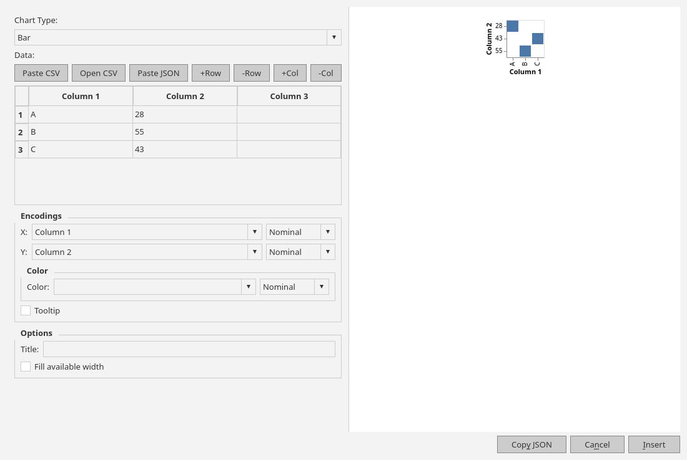

# Gallery

### Preferences

| General | Themes | Editor |
| --- | --- | --- |
|  |  |  |

| Writing | Spelling | Security | Preview |
| --- | --- | --- | --- |
|  |  |  |  |

### Dialogues

| Insert Table | Emoji Picker | KaTeX Equation |
| --- | --- | --- |
|  |  |  |

| Chemistry Notation | Chart Builder | Mermaid Chart |
| --- | --- | --- |
|  |  |  |

| Check Spelling |
| --- |
|  |

| Print / Export PDF |
| --- |
|  |
