# Gallery

## Tabs in a `Corpus`

## Table of Contents

Auto-generated `toc.md` file in the corpus folder

[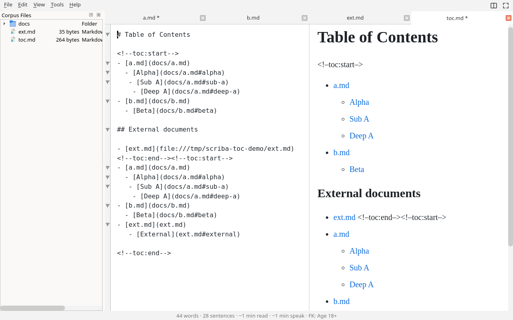](images/toc.png)

## Corpus Files

[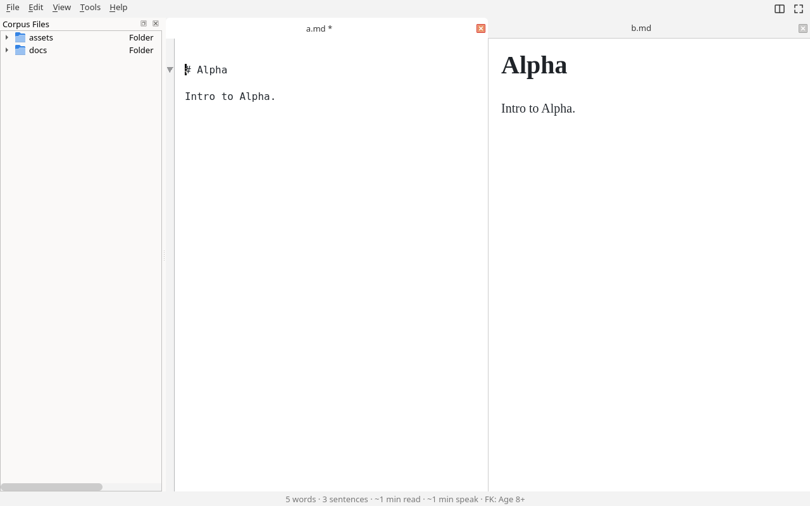](images/corpus-files.png)

## Gutter — chart edit pencil

The pencil in the gutter edits the mermaid/ECharts code block it sits beside using a visual chart assistant.

[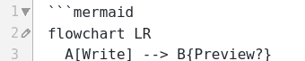](images/gutter-pencil.png)

## Auto Complete Examples

## Markdown Tables

## Preferences

| General | Appearance | Themes | Editor |
| --- | --- | --- | --- |
|  | [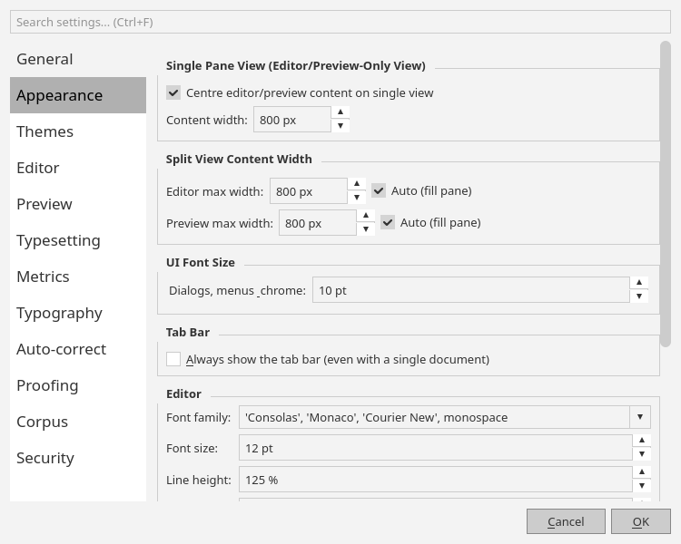](images/preferences-appearance.png) |  |  |

| Preview | Typesetting | Metrics | Typography |
| --- | --- | --- | --- |
|  | [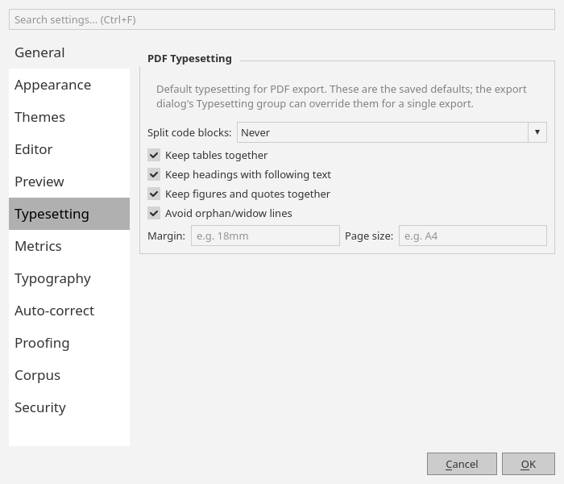](images/preferences-typesetting.png) | [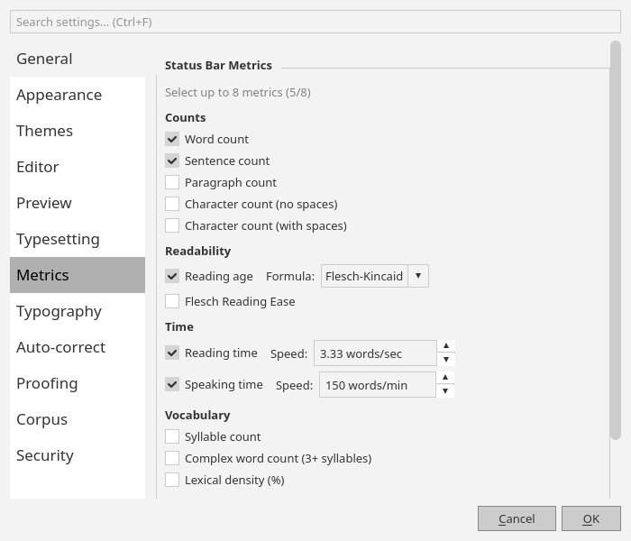](images/preferences-metrics.png) |  |

|   Auto-correct                                                                        |   Proofing                                                                         |   Corpus                                                                         |   Security                                                                          |
|---------------------------------------------------------------------------------------|------------------------------------------------------------------------------------|----------------------------------------------------------------------------------|-------------------------------------------------------------------------------------|
|   [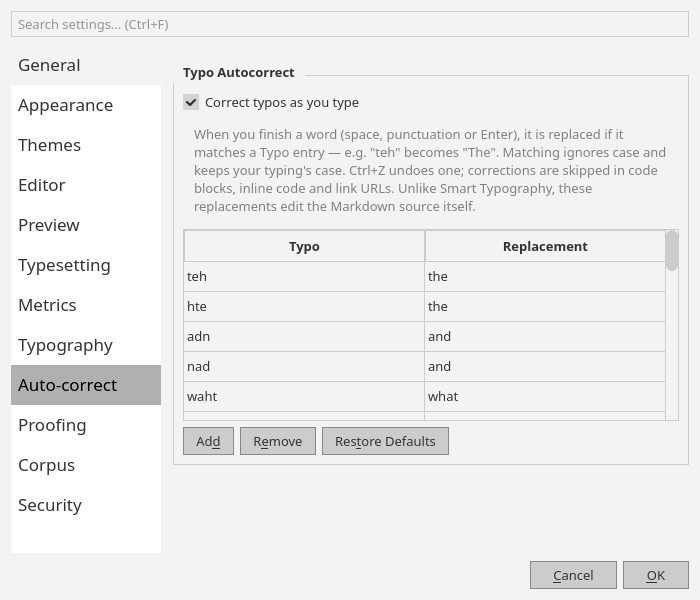](images/preferences-auto-correct.png)   |   [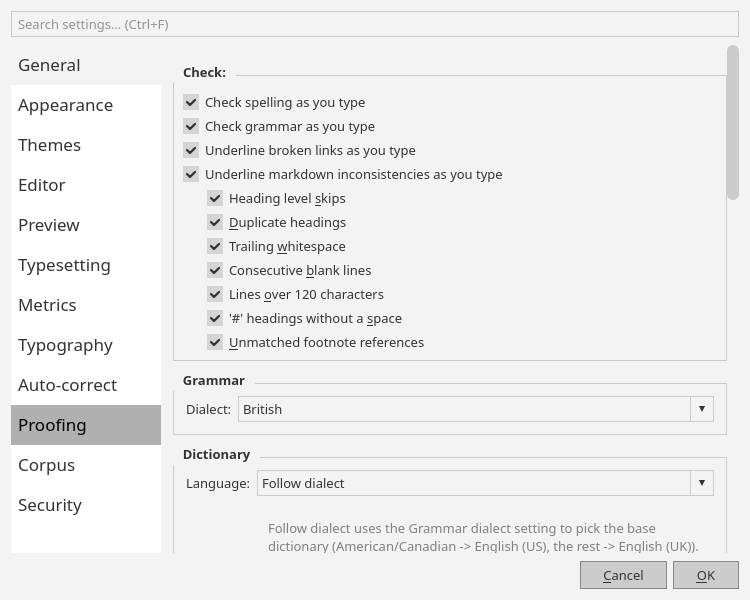](images/preferences-proofing.png)   |   [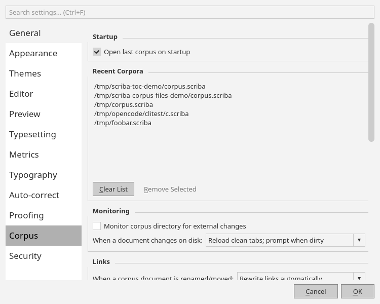](images/preferences-corpus.png)   |      |

## Dialogues

| Insert Table | Emoji Picker | KaTeX Equation | Chemistry Notation |
| --- | --- | --- | --- |
|  |  |  |  |

| Chart Builder | Stock Chart Builder | Advanced Charts | Mermaid Diagrams |
| --- | --- | --- | --- |
|  |  | [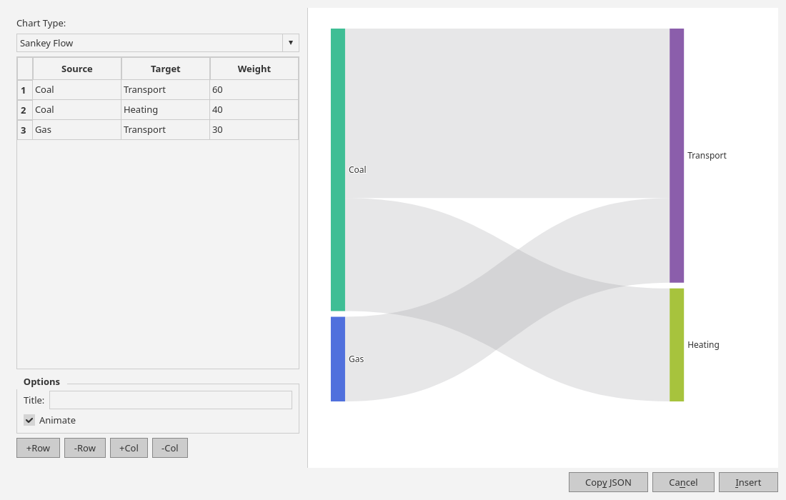](images/advanced-charts.png) |  |

| Mermaid Git Graph | Check Spelling | Validation Report Options |
| --- | --- | --- |
| [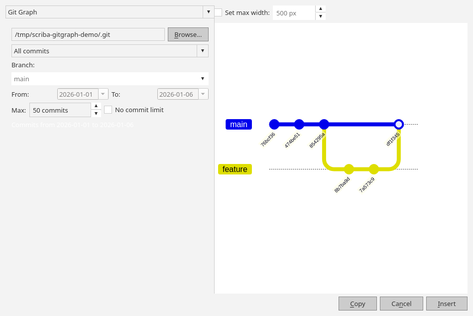](images/mermaid-gitgraph.png) |  |  |

| Print / Export PDF |
| --- |
|  |
