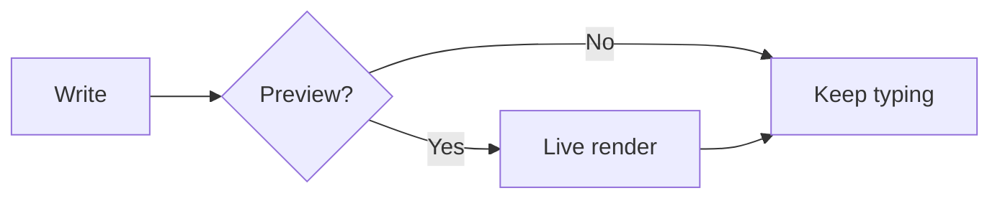
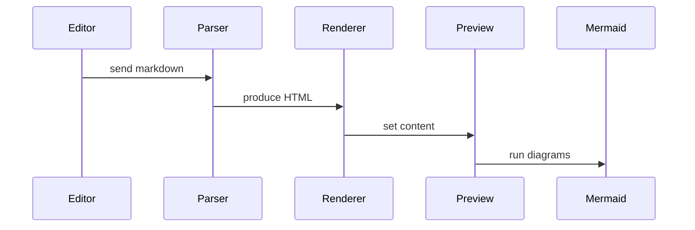
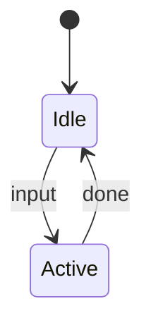
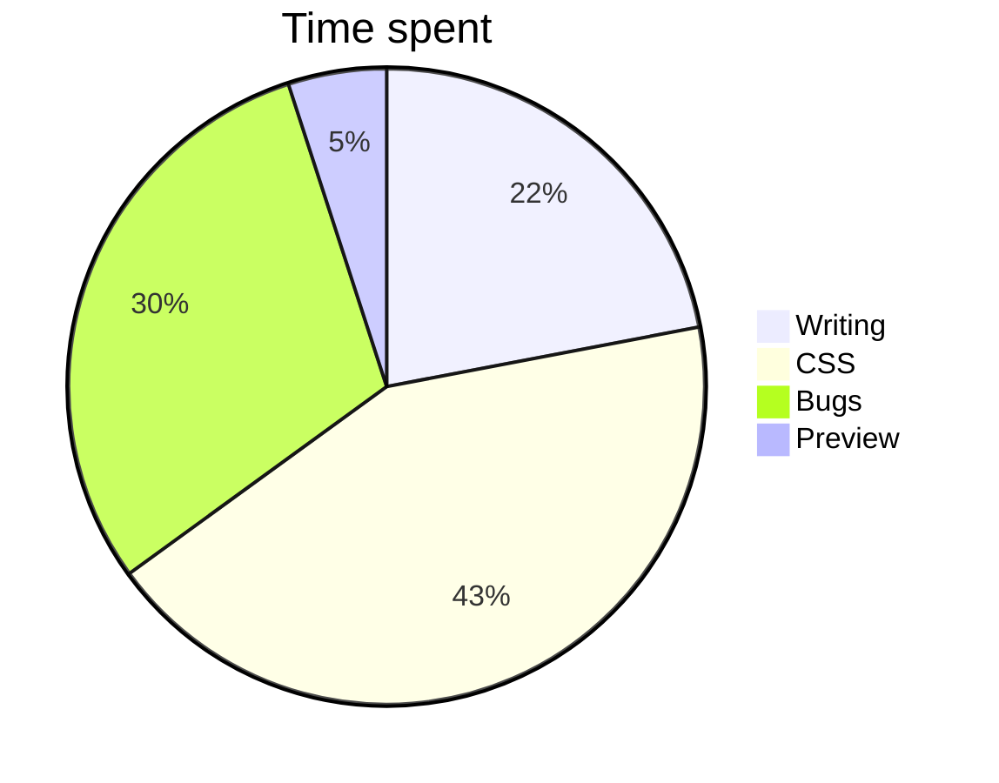

# Kitchen Sink

A quick tour of what Scriba can do.

## Basics

### Typography

**Bold**, *italic*, ~~strike through~~, ==highlighted text==, `inline code`, and a [link](#). Emojis: :rocket: :heart: :sparkles: :smile: :tada:

> Block quote with **inline** styling.
> > Level 1
> > > Level 2

### Smart Typography

When rendering the preview and exports (PDF, DOCX, HTML), Scriba can convert plain typed punctuation into print-quality equivalents. Your Markdown source is never changed — enable the conversions you want in **Preferences → Typography**. Code blocks, inline code, math and raw HTML are always left untouched.

- **Curly quotes and apostrophes:** "double" and 'single' quotes become curly, and don't — it's an apostrophe — 'tis the season.
- **Dashes:** a - b (hyphen), a -- b (en dash), a --- b (em dash).
- **Ellipsis:** To be continued...
- **Multiplication:** 3x4 and 3 x 4.
- **Degrees, fractions and primes:** 90oF, 1/2, 3/4, 5'10" tall.
- **Non-breaking spaces to ensure they stay together:** a bird, 10 kg, 10 %.
- **Symbols:** (c) 2026, (r), (tm), (p), (sm).

### Header Links

Jump to any heading in this document by linking to its slug:

- [Typography](#typography)
- [Smart Typography](#smart-typography)
- [Mermaid Diagrams](#mermaid-diagrams)
- [Find & Replace](#find-replace)

Write `[text](#heading)` for same-document jumps and `[text](other.md#heading)` to jump to a heading in another markdown file. Links to headings that don't exist get a squiggle in the editor.

### Images

Resize with `#WIDTHxHEIGHT` suffix appended to the image URL:

- Original:    ``
- 200x100:     ``
- Width only:  ``
- Height only: ``

For **SVG** (vector) images the size is an exact target, so you can scale an image *up* past its natural size (`#400x` on a 200px-wide SVG renders at 400px, crisply). For bitmap images (PNG, JPG, GIF) `#WxH` only *caps* the size — it never upscales, to avoid blurry enlargement.

Tool tips for title, alt text in that priority. Hover over the below images

-  Alt A
-  Title B
-  Alt C
-  Title D

### Lists

Ordered with `.` markers:

1. First
2. Second
3. Third

Ordered with `)` markers:

1) First
2) Second
3) Third

Unordered with `-` markers:

- Unordered
- Nested
  - Indented
  - Items

Unordered with `+` markers:

+ Plus one
+ Plus two

Unordered with `*` markers:

* Star one
* Star two

Task lists:

- [x] Task done
- [ ] Task pending

### Tables

| Feature       | Status |
|---------------|--------|
| Tables        | ✓      |
| Strikethrough | ✓      |
| Task lists    | ✓      |

### Code

<!-- keep -->

```python
def hello():
    print("Hello, Scriba!")
```

## Markdown Extensions

### Footnotes

Reference a footnote with `[^label]` and define it anywhere with `[^label]:`:

Water is H~2~O[^chem] and boils at 100°C[^bp]. The parser collects
definitions into a footnotes section at the end of the document.

[^chem]: Chemical formula for water.
[^bp]: At sea level, standard atmospheric pressure.

Repeated references share one definition and get back-links:

Gravity accelerates at 9.81 m/s^2^[^g]. It is usually quoted as exactly
that value[^g] in textbooks.

[^g]: Standard gravity at Earth's surface.

### Permissive Autolinks

Bare URLs, e-mail addresses and `www.` links become clickable without any
markup:

- Plain URL: https://example.com/path?q=1
- E-mail: hello@example.com
- WWW: www.example.com

Use `<>` angle brackets for explicit autolinks as usual: <https://example.com>.

### Superscripts & Subscripts

`^text^` renders as a superscript and `~text~` as a subscript:

- Chemical formulas: H~2~O, CO~2~, C~6~H~12~O~6~
- Math-style exponents: 2^10^ = 1024, e^ix^ + 1 = 0
- Units and footnotes-style markers: 10 m^2^, x~1~ + x~2~

### Hard line breaks

By default a single newline inside a paragraph is a soft break — rendered as a
space, and wrapping the line. Enable **Preferences → Preview → Treat single
line breaks as hard breaks** to force every newline to render as a line break
(`<br>`), like a plain-text editor:

Without the setting this paragraph stays on
one line in the preview even though the source is wrapped.

With the setting enabled every newline
in the source produces a visible line break
in the preview.

<!-- page-break -->

## LaTeX Math

See the [KaTeX docs](https://katex.org/) for supported functions and syntax.

Inline math: $E = mc^2$, $\sum_{i=1}^{n} x_i$, $\int_0^\infty e^{-x} \, dx$

Display math:

$$
\frac{n!}{k!(n-k)!} = \binom{n}{k}
$$

$$
\mathcal{L}(\theta) = \prod_{i=1}^{n} f(x_i \mid \theta)
$$

### Chemistry Notation

Powered by [mhchem](https://mhchem.github.io/) for KaTeX. Use `\ce{...}` inside math delimiters.

Inline: $\ce{H2O}$, $\ce{CO2}$, $\ce{H2SO4}$, $\ce{NaCl}$

Reactions: $\ce{CH4 + 2O2 -> CO2 + 2H2O}$

Equilibrium: $\ce{A + B <=> C + D}$

States: $\ce{NaCl(s) ->[\text{H2O}] Na^+(aq) + Cl^-(aq)}$

Ions: $\ce{Fe^{3+}}$, $\ce{SO4^{2-}}$, $\ce{Ca^{2+}}$

Display mode:

$$
\ce{6CO2 + 6H2O ->[\text{light}] C6H12O6 + 6O2}
$$

## Admonitions

> [!note]
> Useful information you shouldn't overlook.

> [!tip] Tip: Read me!
> This admonition has a custom title instead of the default "Tip".

> [!important]
> Something critical to be aware of.

> [!warning]
> Proceed with caution here.

> [!caution]
> This could have negative consequences.

## Mermaid Diagrams

See the [Mermaid docs](https://mermaid.js.org/intro/) for the full syntax reference, and [the specific Mermaid diagrams kitchen sink](mermaid.md) for lots more examples.

### Flowchart



### Sequence diagram



### State diagram



### Pie chart



## ECharts Charts

Charts are written as ECharts option objects in ` ```ec ` code blocks (see the [ECharts docs](https://echarts.apache.org/) for the full option reference) and the [ECharts kitchensink](echarts.md).

### Bar chart

```ec
{
  "tooltip": {"trigger": "axis"},
  "xAxis": {
    "type": "category",
    "data": ["A", "B", "C", "D", "E"]
  },
  "yAxis": {"type": "value"},
  "series": [
    {
      "type": "bar",
      "data": [28, 55, 43, 91, 64]
    }
  ]
}
```

### Scatter plot

```ec
{
  "tooltip": {"trigger": "axis"},
  "xAxis": {"type": "value", "name": "X Axis", "min": 5},
  "yAxis": {"type": "value", "name": "Y Axis", "min": 0},
  "series": [
    {
      "type": "scatter",
      "data": [
        [10, 8],
        [14, 12],
        [22, 18],
        [8, 22],
        [16, 28],
        [30, 20],
        [12, 35],
        [20, 30],
        [26, 38]
      ]
    }
  ]
}
```

### Radar chart

```ec
{
  "tooltip": {},
  "legend": {"data": ["Allocated Budget", "Actual Spending"]},
  "radar": {
    "indicator": [
      {"name": "Sales", "max": 6500},
      {"name": "Administration", "max": 16000},
      {"name": "Information Technology", "max": 30000},
      {"name": "Customer Support", "max": 38000},
      {"name": "Development", "max": 52000},
      {"name": "Marketing", "max": 25000}
    ]
  },
  "series": [
    {
      "name": "Budget vs Spending",
      "type": "radar",
      "data": [
        {"value": [4200, 3000, 20000, 35000, 50000, 18000], "name": "Allocated Budget"},
        {"value": [5000, 14000, 28000, 26000, 42000, 21000], "name": "Actual Spending"}
      ]
    }
  ]
}
```

### Gauge

```ec
{
  "series": [
    {
      "type": "gauge",
      "min": 0,
      "max": 220,
      "progress": {"show": true},
      "axisLine": {"lineStyle": {"width": 18}},
      "pointer": {"length": "60%"},
      "data": [{"value": 168, "name": "Speed"}]
    }
  ]
}
```

### Sankey flow

```ec
{
  "series": [
    {
      "type": "sankey",
      "data": [
        {"name": "a"},
        {"name": "b"},
        {"name": "a1"},
        {"name": "b1"},
        {"name": "c"},
        {"name": "e"}
      ],
      "links": [
        {"source": "a", "target": "a1", "value": 5},
        {"source": "e", "target": "b", "value": 3},
        {"source": "a", "target": "b1", "value": 3},
        {"source": "b1", "target": "a1", "value": 1},
        {"source": "b1", "target": "c", "value": 2},
        {"source": "b", "target": "c", "value": 1}
      ]
    }
  ]
}
```

### Interactive Treemap

```ec
{
  "series": [
    {
      "type": "treemap",
      "data": [
        {
          "name": "nodeA",
          "value": 10,
          "children": [
            {"name": "nodeAa", "value": 4},
            {"name": "nodeAb", "value": 6}
          ]
        },
        {
          "name": "nodeB",
          "value": 20,
          "children": [
            {"name": "nodeBa", "value": 12},
            {"name": "nodeBb", "value": 8}
          ]
        }
      ]
    }
  ]
}
```

## Find & Replace

Use <kbd>Ctrl+F</kbd> to search. Enable **Regex** to use patterns and capture groups in replace.

| Try this search | With replace | Result |
|---|---|---|
| `(\d{4})-(\d{2})-(\d{2})` | `\3/\2/\1` | Converts `2026-07-24` to `24/07/2026` |
| `(\w+) (\w+)` | `\2 \1` | Swaps `hello world` to `world hello` |
| `\bfix(\w*)` | `bug\1` | Renames `fixme fixit` to `bugme bugit` |
| `(["'])(.*?)\1` | `[\2]` | Wraps `"quoted"` text in `[quoted]` |

