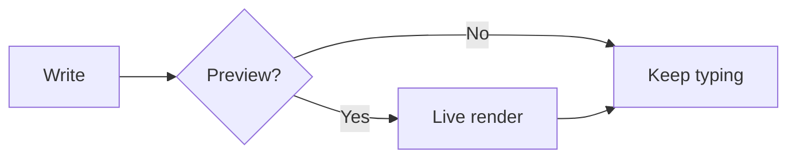
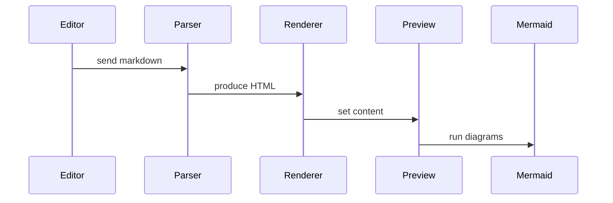
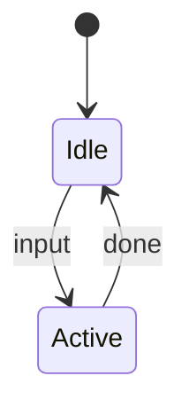
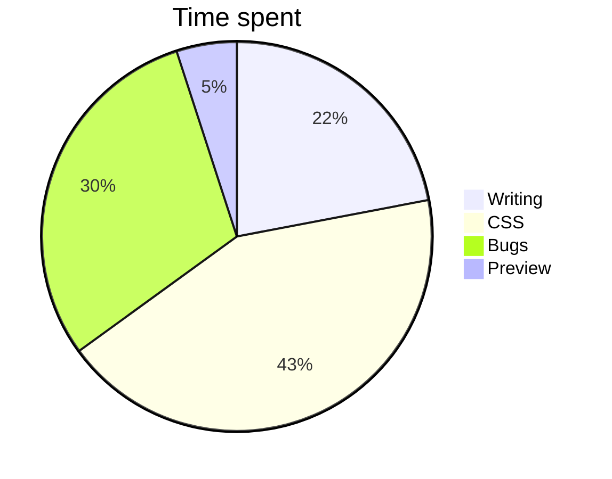

# Kitchen Sink

A quick tour of what Scriba can do.

## Typography

**Bold**, *italic*, ~~strike through~~, `inline code`, and a [link](#). Emojis: :rocket: :heart: :sparkles: :smile: :tada:

> Block quote with **inline** styling.

## Header Links

Jump to any heading in this document by linking to its slug:

- [Typography](#typography)
- [Mermaid Diagrams](#mermaid-diagrams)
- [Find & Replace](#find-replace)

Write `[text](#heading)` for same-document jumps and `[text](other.md#heading)` to jump to a heading in another markdown file. Links to headings that don't exist get an amber squiggle in the editor.

## Images

Resize with `#WIDTHxHEIGHT` suffix appended to the image URL:

- Original:    ``
- 200x100:     ``
- Width only:  ``
- Height only: ``

Tool tips for title, alt text in that priority. Hover over the below images

-  Alt A
-  Title B
-  Alt C
-  Title D

## Lists

1. First
2. Second
3. Third

- Unordered
- Nested
  - Indented
  - Items
- [x] Task done
- [ ] Task pending

## Tables

| Feature | Status |
|---------|--------|
| Tables | ✓ |
| Strikethrough | ✓ |
| Task lists | ✓ |

## Code

```python
def hello():
    print("Hello, Scriba!")
```

## LaTeX Math

See the [KaTeX docs](https://katex.org/) for supported functions and syntax.

Inline math: $E = mc^2$, $\sum_{i=1}^{n} x_i$, $\int_0^\infty e^{-x} \, dx$

Display math:

$$
\frac{n!}{k!(n-k)!} = \binom{n}{k}
$$

$$
\mathcal{L}(\theta) = \prod_{i=1}^{n} f(x_i \mid \theta)
$$

## Chemistry Notation

Powered by [mhchem](https://mhchem.github.io/) for KaTeX. Use `\ce{...}` inside math delimiters.

Inline: $\ce{H2O}$, $\ce{CO2}$, $\ce{H2SO4}$, $\ce{NaCl}$

Reactions: $\ce{CH4 + 2O2 -> CO2 + 2H2O}$

Equilibrium: $\ce{A + B <=> C + D}$

States: $\ce{NaCl(s) ->[\text{H2O}] Na^+(aq) + Cl^-(aq)}$

Ions: $\ce{Fe^{3+}}$, $\ce{SO4^{2-}}$, $\ce{Ca^{2+}}$

Display mode:

$$
\ce{6CO2 + 6H2O ->[\text{light}] C6H12O6 + 6O2}
$$

## Admonitions

> [!note]
> Useful information you shouldn't overlook.

> [!tip]
> This admonition has a custom title instead of the default "Tip".

> [!important]
> Something critical to be aware of.

> [!warning]
> Proceed with caution here.

> [!caution]
> This could have negative consequences.

> [!warning] HIGH VOLTAGE!
> Custom titles work too. Set different icons via CSS.

## Mermaid Diagrams

See the [Mermaid docs](https://mermaid.js.org/intro/) for the full syntax reference.

### Flowchart



### Sequence diagram



### State diagram



### Pie chart



## Vega-Lite Charts

See the [Vega-Lite docs](https://vega.github.io/vega-lite/) for the full spec reference and examples.

### Bar chart

```vl
{
  "$schema": "https://vega.github.io/schema/vega-lite/v6.json",
  "width": "container",
  "data": {
    "values": [
      {"category": "A", "value": 28},
      {"category": "B", "value": 55},
      {"category": "C", "value": 43},
      {"category": "D", "value": 91},
      {"category": "E", "value": 64}
    ]
  },
  "mark": "bar",
  "encoding": {
    "x": {"field": "category", "type": "nominal", "axis": {"labelAngle": 0}},
    "y": {"field": "value", "type": "quantitative"},
    "color": {"field": "category", "type": "nominal"}
  }
}
```

### Scatter plot

```vl
{
  "$schema": "https://vega.github.io/schema/vega-lite/v6.json",
  "width": "container",
  "data": {
    "values": [
      {"x": 10, "y": 8, "category": "Alpha"},
      {"x": 14, "y": 12, "category": "Alpha"},
      {"x": 22, "y": 18, "category": "Alpha"},
      {"x": 8, "y": 22, "category": "Beta"},
      {"x": 16, "y": 28, "category": "Beta"},
      {"x": 30, "y": 20, "category": "Beta"},
      {"x": 12, "y": 35, "category": "Gamma"},
      {"x": 20, "y": 30, "category": "Gamma"},
      {"x": 26, "y": 38, "category": "Gamma"}
    ]
  },
  "mark": "point",
  "encoding": {
    "x": {"field": "x", "type": "quantitative", "title": "X Axis"},
    "y": {"field": "y", "type": "quantitative", "title": "Y Axis"},
    "color": {"field": "category", "type": "nominal"},
    "size": {"field": "y", "type": "quantitative"}
  }
}
```

### Layered chart

```vl
{
  "$schema": "https://vega.github.io/schema/vega-lite/v6.json",
  "width": "container",
  "data": {
    "values": [
      {"day": "Mon", "actual": 28, "forecast": 25},
      {"day": "Tue", "actual": 32, "forecast": 30},
      {"day": "Wed", "actual": 25, "forecast": 28},
      {"day": "Thu", "actual": 38, "forecast": 33},
      {"day": "Fri", "actual": 30, "forecast": 31}
    ]
  },
  "encoding": {
    "x": {"field": "day", "type": "ordinal", "title": "Day of Week"}
  },
  "layer": [
    {
      "mark": {"type": "line", "color": "#4c78a8"},
      "encoding": {
        "y": {"field": "forecast", "type": "quantitative", "title": "Temperature"}
      }
    },
    {
      "mark": {"type": "point", "color": "#e45756", "size": 80, "filled": true},
      "encoding": {
        "y": {"field": "actual", "type": "quantitative"}
      }
    }
  ]
}
```

## Find & Replace

Use <kbd>Ctrl+F</kbd> to search. Enable **Regex** to use patterns and capture groups in replace.

| Try this search | With replace | Result |
|---|---|---|
| `(\d{4})-(\d{2})-(\d{2})` | `\3/\2/\1` | Converts `2026-07-24` to `24/07/2026` |
| `(\w+) (\w+)` | `\2 \1` | Swaps `hello world` to `world hello` |
| `\bfix(\w*)` | `bug\1` | Renames `fixme fixit` to `bugme bugit` |
| `(["'])(.*?)\1` | `[\2]` | Wraps `"quoted"` text in `[quoted]` |

