# Mermaid Diagram Examples

This file demonstrates all supported Mermaid diagram types. Scriba renders ` ```mermaid `
blocks natively in the preview pane. Open this file alongside the preview to see
each diagram rendered.

---

## Flowchart

Process flows, workflows, decision trees, and swimlanes.

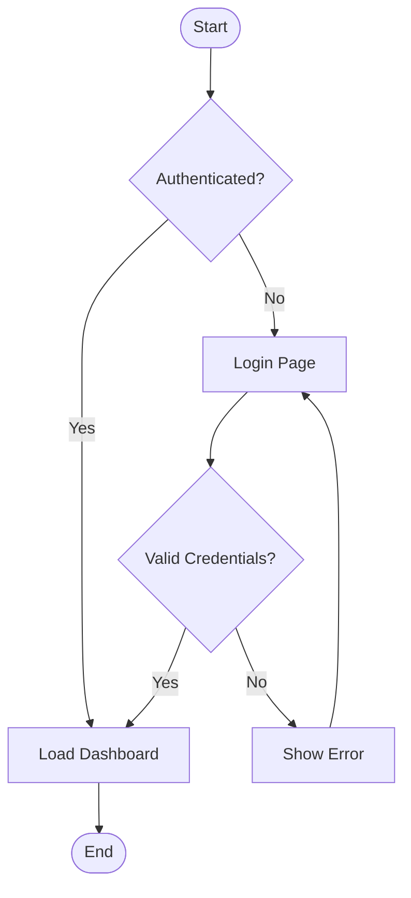

---

## Sequence Diagram

Actor interactions and message flows over time.

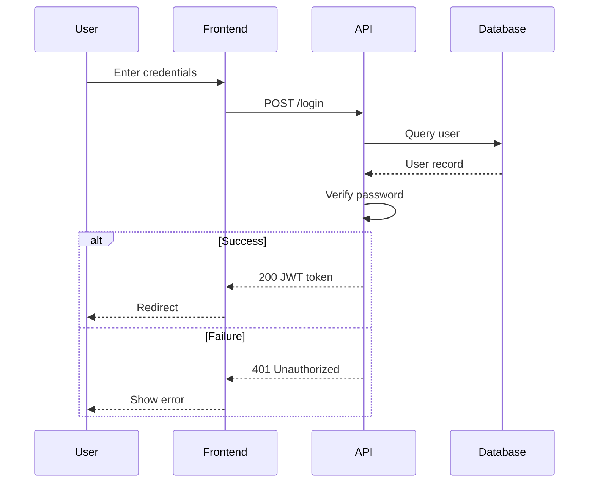

---

## Class Diagram

Object-oriented class structures, interfaces, and relationships.

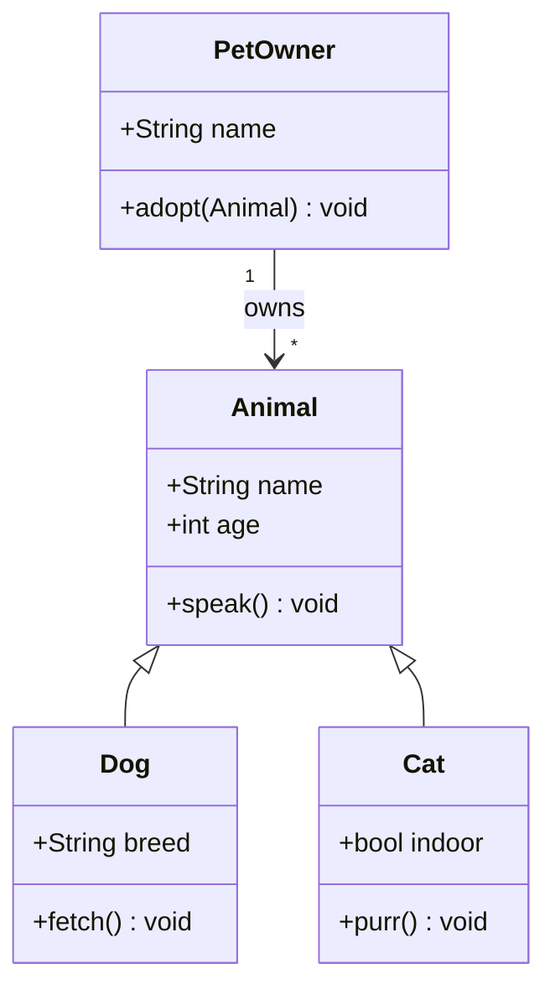

---

## Entity Relationship Diagram

Database entity relationships with cardinality.

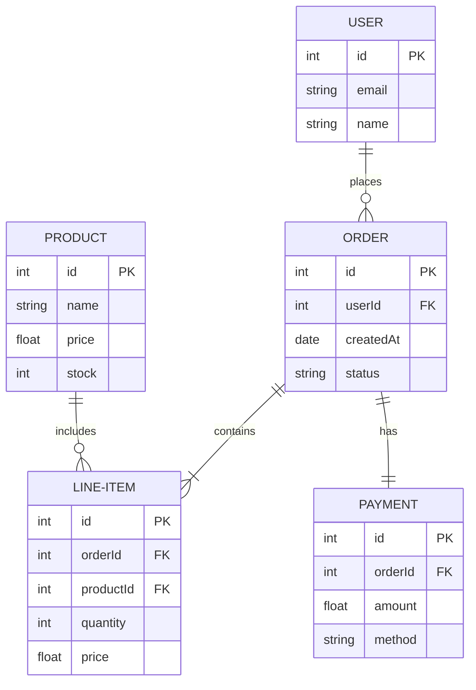

---

## State Diagram

State machines with transitions and substates.

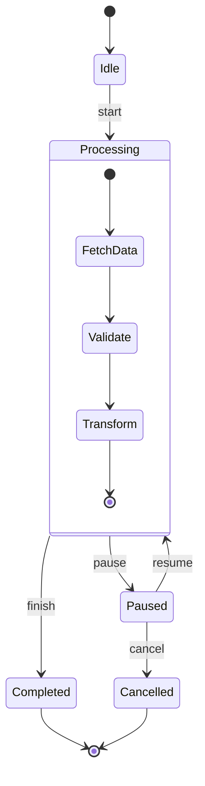

---

## Gantt Chart

Project timelines, task dependencies, and milestones.

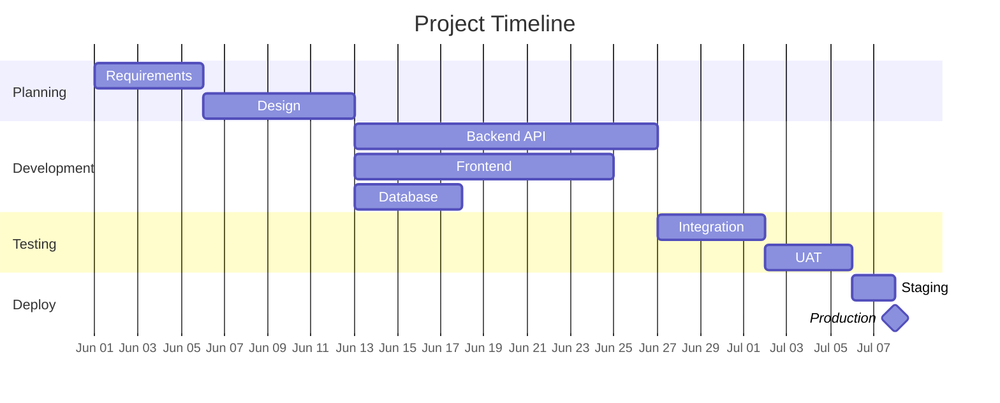

---

## Pie Chart

Proportional data display.

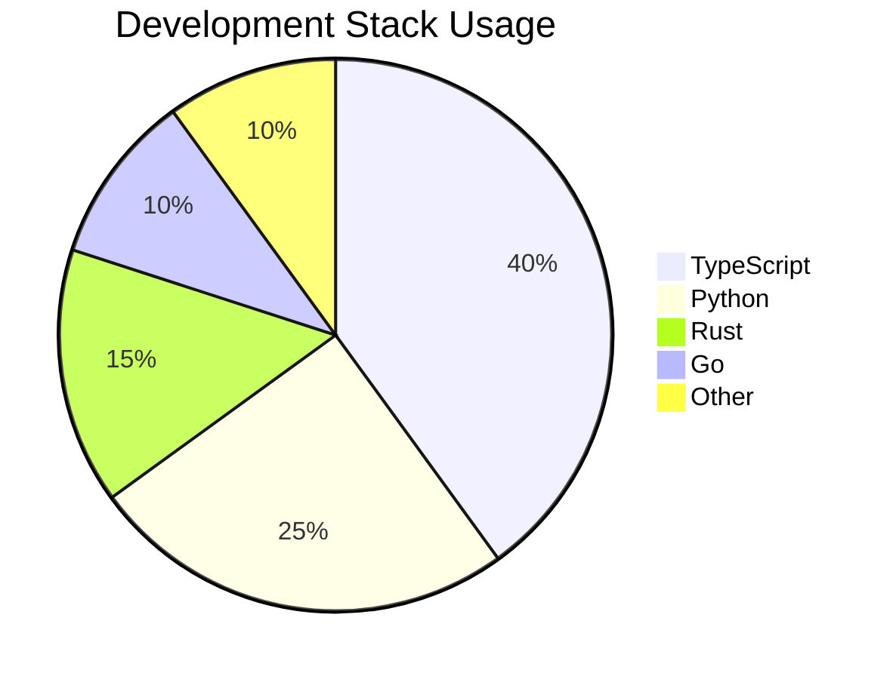

---

## User Journey

User experience maps with satisfaction scores.

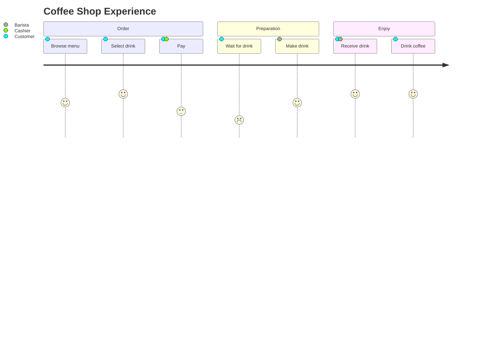

---

## Git Graph

Branch and merge strategies.

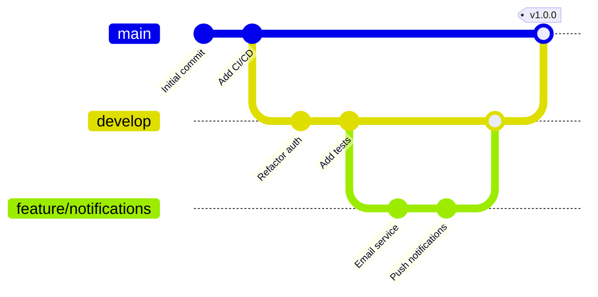

---

## Mind Map

Hierarchical ideas and concept maps.

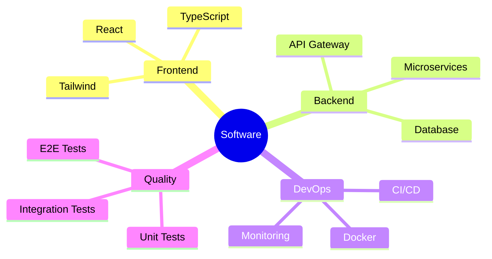

---

## Timeline

Chronological events and milestones.

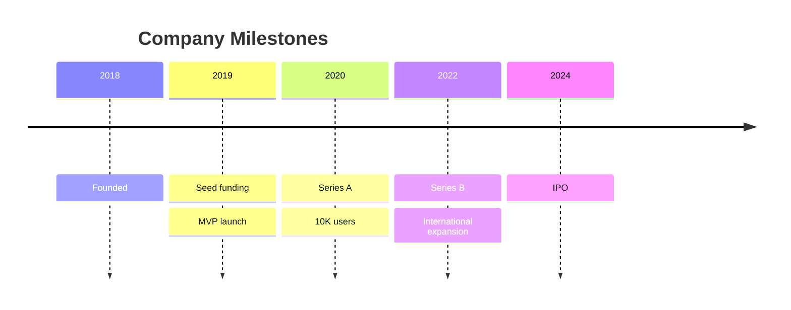

---

## C4 Model

Software architecture context, containers, and components.

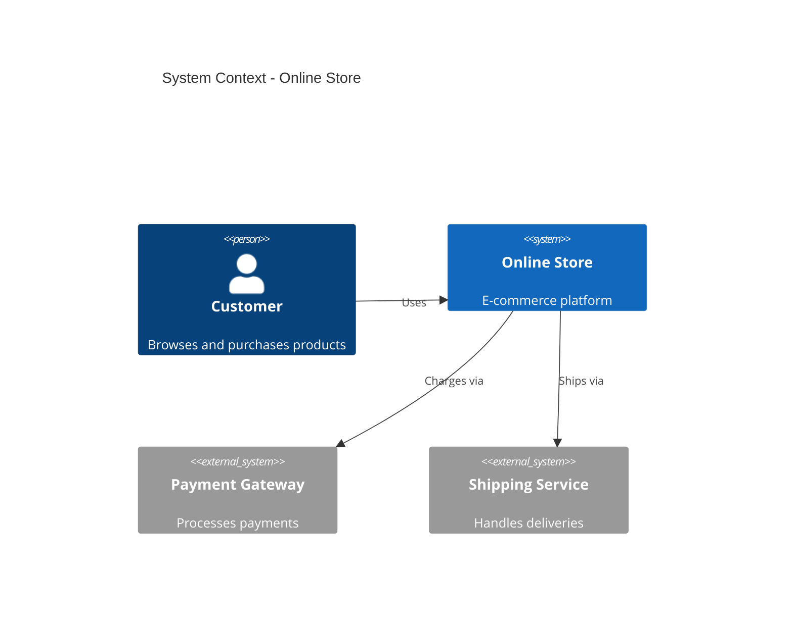

---

## Block Diagram

System blocks with inputs and outputs to represent systems.

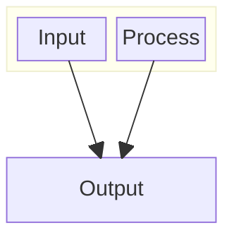

---

## Packet Diagram

Network packet structure visualization.

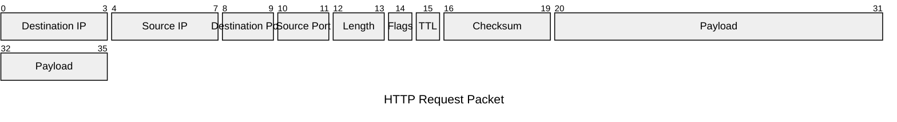

---

## Styled Example

Using Mermaid configuration directives for custom theming.

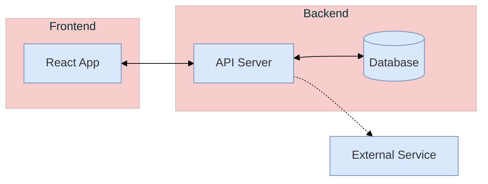
