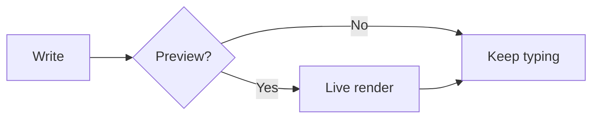
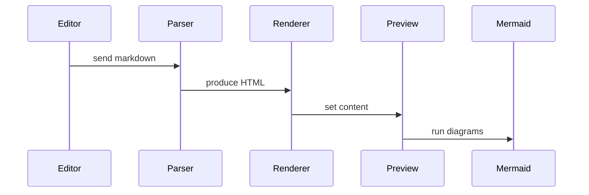
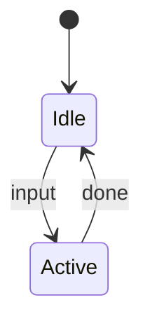
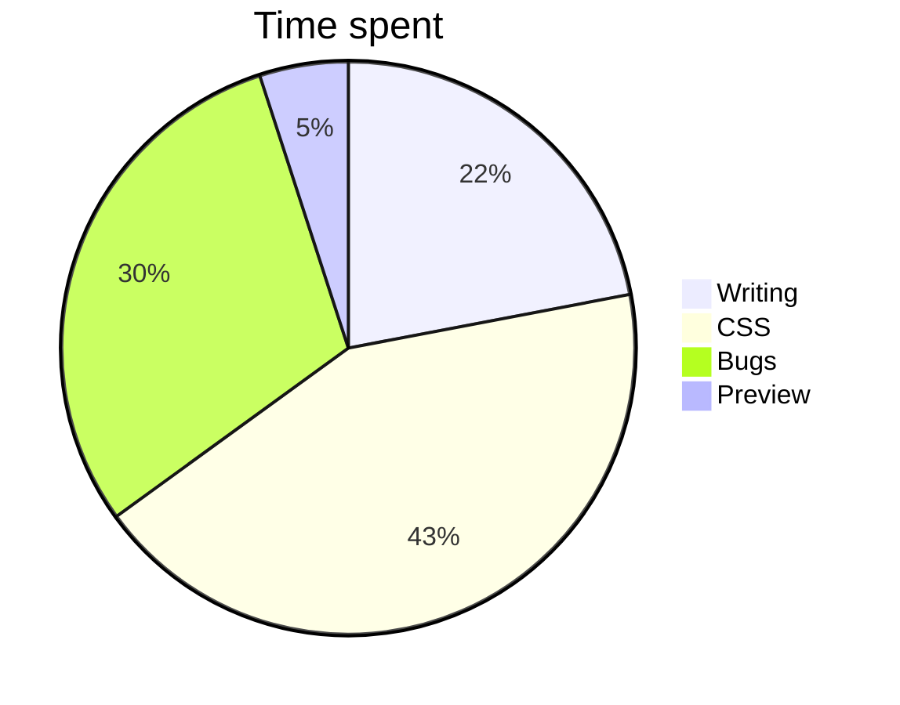

# Scriba Sample

A quick tour of what Scriba can do.

## Typography

**Bold**, *italic*, ~~strikethrough~~, `inline code`, and a [link](#).

> Blockquote with **inline** styling.

---

## Lists

1. First
2. Second
3. Third

- Unordered
- Nested
  - Indented
  - Items
- [x] Task done
- [ ] Task pending

## Tables

| Feature | Status |
|---------|--------|
| Tables | ✓ |
| Strikethrough | ✓ |
| Task lists | ✓ |

## Code

```python
def hello():
    print("Hello, Scriba!")
```

## Admonitions

> [!note]
> Useful information you shouldn't overlook.

> [!tip]
> A helpful suggestion for a better workflow.

> [!important]
> Something critical to be aware of.

> [!warning]
> Proceed with caution here.

> [!caution]
> This could have negative consequences.

## Mermaid Diagrams

### Flowchart



### Sequence diagram



### State diagram



### Pie chart


